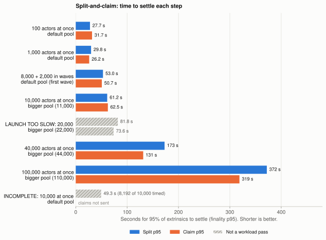
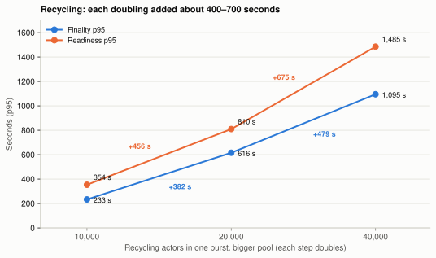

# Coinage stress metrics

*How far we pushed five Coinage flows on a local PreviewNet, and what the numbers tell us.*

Stress testing a chain is not like stress testing a web server. A web server sends a response, and you are done. A chain transaction waits in a pool, goes into a block and then becomes final. Only then do we know if it worked.

So I use a strict rule. A workload **passed** only when every transaction has a verified receipt and the final coin state is correct. Some cases also had a launch-time target.

We ran five flows with 100 to 150,000 actors. We also tried one million. Some runs passed, some failed and some are incomplete. Here's what we found.

The exact numbers are in the [measurement appendix](coinage-stress-metrics-appendix.md). You can also [download the extracted data](evidence/stress-metrics-2026-10-05/metrics.json) and check it yourself.

## The short version

- **10,000 top-ups and 10,000 claims.** One burst of 10,000 on the default pool did not complete. The pool rejected 989 submissions in each flow. Waves and a bigger pool both fixed this.
- **Claims at scale.** The largest verified burst was **150,000 claims**. A second, independent check found zero errors.
- **One block holds 2,363 claims.** This was true for every full block. A bigger pool lets more claims wait. It does not put more claims in a block.
- **Lifecycle campaign.** We selected 16 cases. 12 passed, one failed its launch-time target and three are incomplete. Split-and-claim with 100,000 actors verified all **200,000 receipts**.
- **Recycling is the slowest flow.** 40,000 actors passed. 100,000 actors is **incomplete**: 60,990 verified receipts and 39,917 coins seen as ready.
- **One million claims did not run.** The load generator ran out of memory. This is a limit of our tool, not of the chain.
- **Merchant fan-in.** Up to 20,000 transfers to one merchant were verified. As with top-ups and claims, one burst of 10,000 on the default pool failed, and waves and a bigger pool both completed it.
- **Unloads, preliminary.** The first free-quota and offboarding cases each verified 100 unloads. These are single small cases, not quota or offboarding conclusions.

> These are finite bursts. They do not show a sustainable production TPS or a maximum capacity.

* * *

## What did we test?

Each test sends signed Coinage extrinsics from many test accounts. I call these accounts **actors**. The target is a local PreviewNet with two People collators.

| Flow | What one actor does | Extrinsics per actor |
| --- | --- | ---: |
| [Top-up](scenarios/top-up-burst.md) | Pays with an external test asset and gets a voucher. | 1 |
| [Claim](scenarios/claim-burst.md) | Transfers one coin. The old coin goes away and a new coin replaces it. | 1 |
| [Split-and-claim](scenarios/payment-burst.md) | Splits a coin, then claims it. | 2 |
| [Recycling](scenarios/synchronised-recycling.md) | Loads a coin into a recycler. We then wait for the coin to become ready. | 1 |
| [Merchant fan-in](scenarios/merchant-fan-in.md) | Transfers one coin to the same merchant, into a fresh destination key. | 1 |

Let me be clear: **these tests do not cover the whole wallet**. They do not include the production wallet planner, chat delivery, TrUAPI or the mobile payment screens.

Some test coins are created directly, not through normal issuance. So these tests do not prove the normal backing accounting. Setup transactions and smoke transactions are not in any count.

### Which scenarios did we cover?

We have not tested every scenario yet. Here's where each one stands.

| Scenario | Status | What we ran |
| --- | --- | --- |
| [Top-up burst](scenarios/top-up-burst.md) | Measured | 1,000 to 10,000 top-ups |
| [Claim burst](scenarios/claim-burst.md) | Measured | 1,000 to 150,000 claims |
| [Payment burst](scenarios/payment-burst.md) | Partly measured | Split-and-claim only, 100 to 100,000 actors. Exact and unload payment plans are still to come. |
| [Merchant fan-in](scenarios/merchant-fan-in.md) | Measured | 100 to 20,000 transfers to one merchant |
| [Synchronised recycling](scenarios/synchronised-recycling.md) | Measured | 100 to 100,000 coin loads into one recycler |
| [Free-quota exhaustion](scenarios/free-quota-exhaustion.md) | Preliminary | One case: 100 requests from one person. Five profiles to run. |
| [Offboarding burst](scenarios/offboarding-burst.md) | Preliminary | One case: 100 people. Five profiles to run. |
| [Full-flow ramp](scenarios/full-flow-ramp.md) | Blocked | The runner lost its connection during setup. |
| [Sponsored-pot exhaustion](scenarios/sponsored-pot-exhaustion.md) | Not run yet | Loads that exceed what a sponsored pot can hold |
| [Cleanup backlog](scenarios/cleanup-backlog.md) | Not run yet | Expired-state cleanup while users keep paying |
| [Instance proliferation](scenarios/instance-proliferation.md) | Not run yet | Many Coinage instances at once |
| [Sustained load](sustained-pool-campaign.md) | In development | A three-minute full pool. Not reportable yet. |

### What machine did we test on?

Every run used the self-hosted `parity-large` GitHub runner. We saved the hardware details for the 20,000 to 100,000-claim runs:

| Part | Value |
| --- | --- |
| Machine | Google Cloud VM, Linux 6.17 |
| CPU | AMD EPYC 7B13: 16 cores, 32 logical CPUs |
| RAM | 62.8 GiB |
| Disk | 193 GB system disk |
| Chain nodes | 11 in total: 6 relay validators, 2 People collators, and 1 collator each for Asset Hub, Bulletin and Web3 Storage |
| Load generator | One Node.js process |
| Network delay | None added |

All of this runs on **one machine**. So the load generator shares the CPU and memory with the nodes that it tests.

### How busy was the machine?

We don't have a CPU or memory metric inside each node. But we saved two things every few seconds: the machine's total CPU and memory, and a process list with each process's memory and CPU time. From those, I can show how the load changed from an idle network to the burst.

#### Figure 1: What did the machine do during the 100,000-claim run?

*Figure 1. Time runs from the network start to after the burst. The grey band is fixture preparation and the orange band is the burst. Upper panel: share of all 32 logical CPUs that were busy, and the busiest single CPU. Lower panel: memory used by the whole machine, by each People collator and by the load generator.*

So what changed? The whole machine went from about **5% busy when idle to 12% on average during the burst, with a 21% peak**. That is about 4 of the 32 CPUs on average. The machine never came close to full.

Memory went from about **12 GiB idle to a 19.8 GiB peak**. Be careful with this number. **The load generator adds to it.** It keeps every signed transaction and every watch in memory, so it grows with the burst. During fixture preparation, the machine's memory went up by about 4 GiB, and the load generator alone took about 2.5 GiB of that.

The busiest single CPU often hit 100%, also during fixture preparation, when the collators were almost idle. So a full single CPU here does not always mean a busy chain. The load generator signs on one thread, and we can't tell from these samples which process used that CPU.

Here are the three large claim bursts side by side:

| Claims | Machine CPU: idle → burst average (peak) | Machine memory: idle → burst peak | Collator 1 / 2 CPU during burst | Collator 1 / 2 memory, burst peak |
| ---: | --- | --- | --- | --- |
| 20,000 | 4.5% → 8.6% (20.7%) | 11.9 → 14.8 GiB | 0.59 / 0.44 cores | 1.80 / 1.88 GiB |
| 40,000 | 4.5% → 10.2% (25.2%) | 12.0 → 15.8 GiB | 0.98 / 0.60 cores | 2.17 / 2.16 GiB |
| 100,000 | 4.6% → 12.4% (21.3%) | 11.9 → 19.8 GiB | 1.32 / 0.66 cores | 3.38 / 2.95 GiB |

"Cores" is the average number of CPU cores that the collator process used during the burst. When idle, each People collator used about 0.02 cores and 1.4 to 1.6 GiB. So the burst made collator 1 work much harder, and its memory grew with the size of its queue. I explain why collator 1 works harder than collator 2 under [Figure 5](#figure-5-how-full-did-the-queue-get).

The [host resource data](evidence/host-resources-2026-10-07/host-resources.json) has every sample and the definitions.

### Words I use

- **Default pool:** 8,192 entries and 20 MiB for each People collator. A **bigger pool** has a larger limit for one run, for example 11,000 entries.
- **At once (burst):** we send all transactions together. **In waves (paced):** we send them in groups, for example 8,000 then 2,000.
- **Verified receipt:** we found the transaction in a finalized block, and it shows success and the correct Coinage event.
- **Finality:** the time from sending a transaction to finding its successful, finalized receipt.
- **Readiness:** the time from sending to the first time we see the coin in a finalized ring root. This includes our polling delay.
- **p95:** 95% of transactions finished in this time or less. **N** is the number of transactions that we timed.
- **Reconciliation:** a later check of saved evidence. It can find more receipts. It cannot add more timing samples.

The full definitions are in [Measurement definitions](#measurement-definitions).

## Why do these metrics matter?

You might ask, "Why not just count how many transactions the node accepted?" Let me explain.

Acceptance only tells us that a transaction got in the door. Coinage moves money. So I want to know three things: did the money move, how long did people wait, and what broke first?

- **Verified receipts and coin state** tell us if the money moved. A node can accept a transaction and then lose it. For a wallet, a payment that disappears is the worst result.
- **Finality** tells us how long a person waits for a settled payment. I use p95, not the average. The average hides the people at the back of the queue.
- **Readiness** matters for top-ups and recycling. You cannot use a new coin until it is in a ring root. Finality says the coin landed. Readiness says you can use it.
- **Pool rejections and the ready queue** show what happens when a spike arrives. A rejected transaction fails immediately. A queued transaction waits.
- **Claims per block** shows the real speed limit. A block can only hold a fixed amount of work. This limit sets how fast a queue drains.
- **Launch time and driver memory** tell us if a problem came from the chain or from our test tool.

> Acceptance tells us a transaction got in the door. **A verified receipt tells us the money moved.**

* * *

## How did each flow do?

### Top-ups: waves and bigger pools both got us to 10,000

We did six top-up runs. Four passed and two failed.

- **Passed:** 1,000 at once; 7,000 + 3,000 in waves; 10,000 at once with a bigger pool; and 8,400 + 1,600 in waves on the default pool.
- **Failed:** 10,000 at once on the default pool. The pool rejected 989 submissions, so only 9,011 have receipts.
- **Failed:** 8,500 + 1,500 in waves. We held back the second wave, so only 8,500 top-ups have receipts.

Reconciliation on 30 September 2026 found 40 and 48 more receipts in the two failed runs. This does not change the result. They **stay failed**.

The three newer runs all recovered after the test, and their backing matched the verified top-ups. The earlier runs' recovery records are in the [top-up results](measured-results.md#measured-results). The [top-up measurements table](coinage-stress-metrics-appendix.md#top-up-measurements) has the full numbers.

#### Figure 2: How long did top-ups take?

*Figure 2. Each run has two bars. Blue is finality p95: the payment is settled. Orange is readiness p95: the voucher can be used. Grey bars are failed runs, and they show only the transactions that we timed.*

So what does this chart tell us? For the larger passing runs, 95% of top-ups settled in 183 to 256 seconds. The vouchers became ready about 80 to 100 seconds after that.

Each run has a different size, schedule and pool. The two failed runs also have fewer timed transactions, so their bars are not the full story. But when I put the runs side by side by batch size, a clear pattern shows up.

#### Figure 3: Does top-up time grow with the batch size?

*Figure 3. The horizontal axis is the number of top-ups that entered the pool in the largest single batch: 7,000 for the 7,000 + 3,000 run, and 9,011 for the failed 10,000 burst. Filled dots are passing runs; the dashed lines are a straight-line fit through them. Hollow dots are failed runs, which are not used for the lines.*

This is the most interesting top-up result. **Time grows in a straight line with the batch size.** Each extra 1,000 top-ups in the batch added about **22 seconds** to finality p95 and about **28 seconds** to readiness p95. Every passing run is within 4 seconds of the finality line and within 8 seconds of the readiness line. The two failed runs also sit close to the lines.

In percentages: 10 times more top-ups (1,000 to 10,000) made finality p95 **383% longer** (53 to 256 seconds) and readiness p95 **234% longer** (106 to 353 seconds). Time grew slower than the batch, because part of the time is a fixed cost: about 29 seconds for finality and 76 seconds for readiness, even for a small batch.

Why a straight line? A block can only hold a fixed amount of work, so a queue drains at a steady rate. For finality, 22 seconds per 1,000 top-ups is about 45 top-ups per second. We see the same steady drain for claims in [Figure 6](#figure-6-how-many-claims-fit-in-one-block).

Keep this in proportion. There are only four passing runs. They differ in pool, schedule and harness version, and the p95 for a run in waves covers both waves. So this is a strong pattern, not a proven model.

### Claims: the lightest flow, and the biggest bursts

Claims are where we pushed the hardest. Let's start with the run that didn't work.

The 10,000 burst on the default pool verified only **8,192** claims. The pool rejected 989 submissions immediately, and we lost the watch on 819 more. At the saved cutoff, those 819 coins had not changed.

Every other claim run passed. Each claim removed the old coin and created the correct new coin. The fixture backing did not change in any run.

We checked the **150,000** run again on **2 October 2026 at 03:05 UTC**, with a separate verifier. It found 150,000 receipts and 150,000 correct coin states, with zero errors.

> 150,000 claims, 150,000 verified receipts, **zero errors**.

What about one million? We tried. The load generator used all of its 24 GiB of memory before it finished. So we have no receipts to check. **This is a limit of our tool, not of the chain.** The [fix](https://github.com/paritytech/polkadot-pop-e2e/commit/932677d50e07052e62d45356a334801dc4630270) makes the tool keep less data in memory. We tested the fix with one million fake notifications, not with one million real transactions.

The [claim measurements](coinage-stress-metrics-appendix.md#claim-measurements) table has all launch times and stage times.

#### Figure 4: How long did the slowest claims wait?

*Figure 4. Each line goes from p50 (the open circle) to p99 (the diamond). The filled circle is p95. Every run timed all of its claims.*

What do the three marks mean?

- **p50:** half of the claims settled faster than this. It's the typical wait.
- **p95:** 95% settled faster. Only the slowest 1 in 20 took longer.
- **p99:** 99% settled faster. Only the slowest 1 in 100 took longer.

So why are p95 and p99 almost the same, like 139 and 140 seconds at 40,000? Because the slowest claims all leave in the last block. The slowest 5% of 40,000 claims is 2,000 claims, and one block holds up to 2,363 ([Figure 6](#figure-6-how-many-claims-fit-in-one-block)). So the slowest 5% and the slowest 1% settle together in the same final block. At 20,000 it's the same: the slowest 5% is 1,000 claims, all in the last block.

At 100,000 the slowest 5% is 5,000 claims, which is more than two blocks. So p95 and p99 land in different blocks near the end, and they're 9 seconds apart: 297 and 306 seconds. In every run, there was no long tail of very slow claims. Claims waited in a queue, and the queue drained at a steady rate.

These are three separate setups with different pool limits. Don't draw a line through them.

#### Figure 5: How full did the queue get?

*Figure 5. One panel for each burst size. The lines show how many claims waited in each People collator's ready queue. The grey line shows when both queues were empty.*

The queue filled up in the first 10 to 50 seconds. Then it went down at a steady rate until it was empty. That steady rate matches the fixed number of claims in each block (Figure 6).

We sampled the queue every five seconds, so we can miss short peaks.

Why does collator 1 hold so many more claims than collator 2? At 100,000 claims it peaked at 88,185, and collator 2 at only 18,821. **Our load generator sends every claim to collator 1.** Its RPC address is collator 1 (port 10010), and that's the only node it talks to. Collator 2 only gets the claims that collator 1 passes on over the peer-to-peer network. The node passes transactions on in batches, and collator 2 must check each one before it enters its own queue. So collator 2 holds fewer at any moment. This is our reading of the setup; we did not measure the gossip itself.

The CPU numbers agree. During the 100,000 burst, collator 1 used 1.32 cores and collator 2 used 0.66 cores (see [How busy was the machine?](#how-busy-was-the-machine)).

Can we split the work evenly? Yes, but it's a test change, not a chain change: the load generator could send half of the claims to each collator. Both queues still empty at the same time, because a claim leaves both queues as soon as it is in a block. A real wallet population would also spread over many RPC nodes, so the even split is closer to production.

#### Figure 6: How many claims fit in one block?

*Figure 6. Each bar is one finalized block. Blue bars are full blocks. The grey bar is the last block, which held the claims that were left.*

This is the clearest result in the report. **Every full block held exactly 2,363 claims.** In the 100,000 run, all 42 full blocks stopped because they hit the block weight limit.

This also explains Figure 5. The pool decides how many claims can wait. The block weight limit decides how fast they leave. Each new block takes about 2,363 claims out of the queue, so the lines in Figure 5 go down in a straight line.

> A bigger pool lets more claims wait. **It doesn't make blocks hold more claims.**

What about the machine? Average CPU use peaked at 21–25%. That looks relaxed. But one CPU core reached about 98% in the 100,000 run. So a low average does not rule out a single-thread limit.

The test tool also used more memory as the bursts got larger:

| Claims | Driver memory (RSS) | JavaScript heap |
| ---: | ---: | ---: |
| 20,000 | 1.189 GiB | 0.558 GiB |
| 40,000 | 1.688 GiB | 0.946 GiB |
| 100,000 | 2.820 GiB | 1.567 GiB |

This is the test tool's memory, not the chain's memory. See the [claim resources table](coinage-stress-metrics-appendix.md#claim-resources).

### Split-and-claim and recycling: the lifecycle campaign

The lifecycle campaign ran 16 cases: eight for split-and-claim and eight for recycling. Before we look at timing, let's see what finished.

#### Figure 7: How many extrinsics have a verified receipt?

*Figure 7. Each bar shows verified receipts divided by requested extrinsics. Split-and-claim requests two extrinsics for each actor. Grey bars are cases that did not pass.*

Most cases reached 100%. Three did not:

- **Split-and-claim, 10,000 at once, default pool:** 8,192 of 10,000 splits verified. We did not send the claims.
- **Recycling, 10,000 at once, default pool:** 8,724 of 10,000 verified.
- **Recycling, 100,000:** 60,990 of 100,000 verified.

One case reached 100% and still failed. Split-and-claim with 20,000 actors verified all 40,000 receipts. But our tool took 1.10 seconds to launch the splits, and the target was 1.00 second. So it is a **launch-time failure**. This is why I keep each outcome separate.

Two cases passed, but CI did not shut down cleanly after the test. These are split-and-claim at 40,000 and recycling at 40,000. The workload result and the CI result are separate.

#### Figure 8: How long did split-and-claim take?

*Figure 8. Blue is the split step and orange is the claim step. Both bars show finality p95. For the run in waves, the bars show the first wave of 8,000. Grey bars are cases that did not pass.*

Up to 10,000 actors, both steps settled in about 25 to 65 seconds. At 100,000 actors, splits took 372 seconds and claims took 319 seconds.

The [split-and-claim wave timings](coinage-stress-metrics-appendix.md#split-and-claim-wave-timings) table has every wave.

#### Figure 9: How long did recycling take?

*Figure 9. Blue is finality p95: the load is settled. Orange is readiness p95: the coin is in a ring root. Grey bars are incomplete cases, and they show only the part that we observed.*

Recycling is much slower than the other flows. At 40,000 actors, 95% of coins became ready in 1,485 seconds. That is almost 25 minutes.

Be careful with the 100,000 bar. It shows 1,719 seconds, but only for the 39,917 coins that we saw before we stopped looking at 1,798 seconds. The other 60,083 coins have no timing. So the real p95 for 100,000 is not known.

Here's the tricky part with the 100,000 case. **A missing receipt does not prove that a transaction failed.** But a state change alone does not prove a successful receipt either. Three blocks are also missing from the saved evidence. So I call it incomplete, and I don't guess in either direction.

See the [recycling outcomes](coinage-stress-metrics-appendix.md#recycling-outcomes) and [recycling readiness](coinage-stress-metrics-appendix.md#recycling-readiness) tables.

#### Figure 10: What happens to recycling time when the burst doubles?

*Figure 10. Passing recycling cases with a bigger pool. Each step on the horizontal axis doubles the number of actors. The coloured numbers are the added seconds for each doubling. The incomplete 100,000 case is not shown, because its p95 covers only part of the burst.*

There's an interesting pattern here. Each time the burst doubled, finality p95 went up by about **400 to 500 seconds** (+382, then +479) and readiness p95 by about **450 to 700 seconds** (+456, then +675).

The step is not the same each time; it grew. And three points can't tell us the exact shape of the curve. To know, we need a passing case between 40,000 and 100,000, such as 80,000.

Split-and-claim grows more slowly. Its split p95 went from 61 seconds at 10,000 actors to 372 seconds at 100,000: about 3.5 seconds per 1,000 actors (Figure 8).

### What happens when 10,000 arrive at once on the default pool?

Every flow ran one burst of 10,000 on the default pool. **Every one of them rejected exactly 989 transactions at the door.** Here's what happened to all 10,000 in each flow:

| Flow | Rejected at pool entry | Watch lost | Verified receipts | No verified receipt |
| --- | ---: | --- | ---: | ---: |
| Top-up | 989 (9.9%) | 40, all found later | 9,011 (90.1%) | 989 (9.9%) |
| Claim | 989 (9.9%) | 819; the coins had not changed at the cutoff | 8,192 (81.9%) | 1,808 (18.1%) |
| Merchant fan-in | 989 (9.9%) | 818, all found later | 9,011 (90.1%) | 989 (9.9%) |
| Split (first step of split-and-claim) | 989 (9.9%) | 819, none found | 8,192 (81.9%) | 1,808 (18.1%) |
| Recycling | 989 (9.9%) | 532, of which 245 found later | 8,724 (87.2%) | 1,276 (12.8%) |

Why exactly 989? Because 10,000 − 989 = 9,011, and 9,011 = 8,192 + 819. The default pool has 8,192 slots for ready transactions. Substrate also keeps a second queue for transactions that can't run yet, [one tenth of that size](https://github.com/paritytech/polkadot-sdk/blob/master/substrate/client/transaction-pool/src/builder.rs): 819. So the pool took 9,011 and turned the rest away immediately. The 819 lost watches in the claim and split runs are the same size as that second queue, but we have not confirmed that they are the same transactions.

So, on the default pool, about **1 in 10 transactions failed straight away**, in every flow. Between 10% and 18% ended with no verified receipt. Waves and a bigger pool both avoided this.

### Merchant fan-in: many payments to one merchant

Merchant fan-in sends many coin transfers to one merchant. Each transfer goes into a fresh destination key, from a coin that the fixture prepared. It does not include chat delivery or the production wallet.

We ran six cases in [run 37510457575, attempt 1](https://github.com/paritytech/polkadot-pop-e2e/actions/runs/37510457575/attempts/1). Five passed and one failed.

#### Figure 11: How long did merchant transfers take?

*Figure 11. Each bar is finality p95 for one case. The label also gives verified receipts out of transfers sent. The grey bar is the failed case, and it shows only the 8,193 transfers that we timed.*

All five passing cases verified every transfer. The largest, 20,000 at once on a bigger pool, settled 95% of transfers in 91 seconds. That is close to the 94 seconds for 20,000 claims (Figure 4), which makes sense: each merchant transfer is a claim.

Now the case that failed. We sent 10,000 transfers at once on the default pool. The pool rejected 989 immediately, and we lost the watch on 818 more. The run's own audit verified 8,193 receipts.

On 7 October 2026 we reconciled the 818 lost watches from saved blocks. All 818 were in canonical, finalized blocks, with success and the `Coinage.CoinTransferred` event. None of the 989 rejected transfers is in a saved block. So the total is 8,193 + 818 = **9,011 verified receipts**, which matches the 9,011 correct coin states.

This case **stays failed**. Reconciliation adds receipts, not timing samples, so its p95 still uses the 8,193 timed transfers.

> Same pattern, new flow: one 10,000 burst on the default pool fell short. **Waves and a bigger pool both completed it.**

The appendix has the [full merchant measurements](coinage-stress-metrics-appendix.md#merchant-fan-in-measurements), with p50, p95 and max, launch windows and job links. As with the other flows, each bar is a separate setup. Don't read Figure 11 as a trend.

### Free-quota and offboarding: first unload cases (preliminary)

Both of these flows unload coins into the external asset. Each one has only a single measured case so far, so I treat both as preliminary.

**Free-quota exhaustion, 100 requests.** [Run 37570768389](https://github.com/paritytech/polkadot-pop-e2e/actions/runs/37570768389/attempts/1) sent 100 unload requests on the default pool. All 100 setup top-ups finalized first. We verified all 100 unload receipts, and we checked them again offline from the saved blocks. Finality p50 / p95 / max was 43.08 / 55.02 / 55.02 seconds, with N = 100.

The free-token allowance was 1,000. So all 100 requests came from **one person**. This is 100 transactions from 1 person, not 100 users.

We also tried two requests that must fail, and both failed as designed:

- Reusing a consumed token was rejected with custom error 57 (`UnloadTokenAlreadyConsumed`).
- A counter at the limit was rejected with custom error 58 (`UnloadTokenCounterOutOfRange`).

**Offboarding, 100 people.** [Run 37590878841](https://github.com/paritytech/polkadot-pop-e2e/actions/runs/37590878841/attempts/1) sent 100 unloads from 100 different people on the default pool. All 100 setup top-ups finalized. We verified all 100 unload receipts locally from the saved artifact. Finality p50 / p95 / max was 49.16 / 61.12 / 61.12 seconds, with N = 100.

**Proof generation, a first measurement.** Each unload needs two ring-VRF proofs: one for the recycler alias and one for the free token. So each case made 200 proofs.

| Case | Recycler proof p50 / max | Free-token proof p50 / max |
| --- | --- | --- |
| Free quota, 100 | 1.406 / 1.455 s | 0.786 / 0.835 s |
| Offboarding, 100 | 1.411 / 1.479 s | 0.827 / 0.880 s |

So one unload took about 2.2 seconds of proof work. The client made the proofs before it sent anything. This is the client's preparation cost, not part of finality.

What these cases don't show: we did not test a real period rollover. The policy rows come from a separate model, not from native iOS or Android code. The other five quota profiles and five offboarding profiles have not run yet. See the [quota and offboarding table](coinage-stress-metrics-appendix.md#free-quota-and-offboarding-measurements).

### Which tests did not reach their measured load?

Some tests stopped before their measured workload began. These have no result yet.

| Scenario | What happened | What it establishes |
| --- | --- | --- |
| Free-quota exhaustion | First campaign: smoke passed; all six measured cases stopped during fixture top-ups. Cause found and fixed (below). The 100-request case has since passed independently. | Five profiles still to run; no burst-capacity conclusion yet |
| Offboarding | Same setup failure as quota; smoke passed. The 100-person case has since passed independently. | Five profiles still to run; no burst-capacity conclusion yet |
| Full flow | Smoke failed while preparing the network: GitHub reports the self-hosted runner lost communication. Six cases skipped. | No measured workload result; cause of the runner loss not established |

Why did quota and offboarding stop? The test client sent its setup top-ups through a path that the node allows only 16 at a time on each connection. Above that, the extra transactions were silently never sent. Only 16 of the 100 setup top-ups reached the pool. This was a bug in our test harness, not a chain result. The [fix](https://github.com/paritytech/polkadot-pop-e2e/commit/e9c982bb296a344d8c6629dcc8a82971c107438e) sends setup through the same path as the workload.

The jobs are in [run 37510457575, attempt 1](https://github.com/paritytech/polkadot-pop-e2e/actions/runs/37510457575/attempts/1):

- **Quota:** [smoke](https://github.com/paritytech/polkadot-pop-e2e/actions/runs/37510457575/job/112436114495), [100](https://github.com/paritytech/polkadot-pop-e2e/actions/runs/37510457575/job/112526429833), [1,000](https://github.com/paritytech/polkadot-pop-e2e/actions/runs/37510457575/job/112532845219), [10,000 at once](https://github.com/paritytech/polkadot-pop-e2e/actions/runs/37510457575/job/112539289683), [10,000 in waves](https://github.com/paritytech/polkadot-pop-e2e/actions/runs/37510457575/job/112545534951), [10,000 bigger pool](https://github.com/paritytech/polkadot-pop-e2e/actions/runs/37510457575/job/112551090694), [20,000 bigger pool](https://github.com/paritytech/polkadot-pop-e2e/actions/runs/37510457575/job/112556615978).
- **Offboarding:** [smoke](https://github.com/paritytech/polkadot-pop-e2e/actions/runs/37510457575/job/112440932803), [100](https://github.com/paritytech/polkadot-pop-e2e/actions/runs/37510457575/job/112561845169), [1,000](https://github.com/paritytech/polkadot-pop-e2e/actions/runs/37510457575/job/112567282589), [10,000 at once](https://github.com/paritytech/polkadot-pop-e2e/actions/runs/37510457575/job/112572580926), [10,000 in waves](https://github.com/paritytech/polkadot-pop-e2e/actions/runs/37510457575/job/112577483596), [10,000 bigger pool](https://github.com/paritytech/polkadot-pop-e2e/actions/runs/37510457575/job/112582692332), [20,000 bigger pool](https://github.com/paritytech/polkadot-pop-e2e/actions/runs/37510457575/job/112587829742).
- **Full flow:** [smoke](https://github.com/paritytech/polkadot-pop-e2e/actions/runs/37510457575/job/112446686310); the six cases were skipped.

A sustained-load test is also in development. It is not reportable yet.

* * *

## So what do the results tell us?

It's easy to read too much into these numbers. Here's what I think they do and don't show.

- **The pool sets how many can wait. The block limit sets how fast they leave.** A bigger pool gave more space to wait. It did not make the chain process more.
- **Waves and bigger pools both work.** Each one completed some workloads that a single burst on the default pool did not.
- **A passed run is not a maximum.** It does not show production capacity, sustainable TPS, runtime-weight accuracy, block execution time or PVF deadline compliance.
- **A receipt and a coin state are different checks.** We need both. Our evidence comes from local RPC nodes. It is consistent, but it is not a cryptographic proof.
- **This report does not rerun anything.** It reads the saved measurements again. Original runs, reruns, CI results and later checks stay separate. Their dates are in the appendix.
- **Merchant fan-in follows the same pattern.** Waves and a bigger pool each completed 10,000 transfers to one merchant, and one default-pool burst did not. These separate runs do not show a latency trend, sustainable throughput or production capacity.

> A burst that passed tells us the chain handled that burst. **It isn't a capacity ceiling.**

In the end, Coinage on this setup verified a 150,000-claim burst and a 100,000-actor split-and-claim burst. We checked every receipt. We also know where runs stopped short: single 10,000 bursts on the default pool, and recycling with 100,000 actors. That's a solid baseline, not the final word.

* * *

## Measurement notes and evidence

If you want to check my work, this is where to look.

### Measurement definitions

- All times are in **seconds**. Finality includes client and RPC time. Readiness includes polling delay.
- Percentiles are nearest-rank values over the stated population. We never average them across runs or nodes.
- Reconciliation adds receipts. It never adds timing samples. In the appendix, an em dash means that the record does not give that value.
- Launch time and launch rate measure the client. They do not measure how fast the node accepts or runs transactions. A burst does not run in one block.
- **Stage duration.** Lifecycle stages include audits, signing between waves and readiness observation. They do not include setup, fixtures, smoke or recovery. Top-up and claim stages include waits, observer shutdown and final state reads. They do not include fixture setup, the final receipt audit or recovery.
- Recovery checks show that the chain is live and both authors make blocks. Recovery time is not a queue-drain time.
- Claim timings come from the saved `claim-burst-transactions.jsonl` file. They start at each call's own send time. The finalized notification and the receipt lookup are separate timestamps.
- Queue charts use each collator's own `substrate_ready_transactions_number` gauge. Driver memory comes from the burst observer samples.
- Proposal duration is block authoring time, not PVF execution time. The longest proposal took 2.970 seconds.

### Environment and pool configuration

The lifecycle campaign used engine `7907a3bfa7b2e47535a74b7920086a05ca94773a` and snapshot bundle run 36614342201. It had six relay validators, two People collators and the other snapshot parachains, all on one runner, with no added delay. Bigger lifecycle pools used 256 MiB for each People collator. Default cases did not change the pool. We did not retry any transaction.

The saved records show 27 driver runs that did not overlap. They cannot show if a process stayed alive after a runner was lost. The 16 cases are the selected attempts from the completion audit. Earlier setup failures are in the [original-attempt record](lifecycle-campaign-results.md#outcomes).

The 20,000 to 100,000 claim runs used the same engine and snapshot, the `polkadot-weekly2026w33-rc2` binaries and the People runtime `next-people-paseo` (spec 3003000, transaction version 5). The runner had an AMD EPYC 7B13 with 16 cores, 32 logical CPUs and about 62.8 GiB of RAM. The network and the driver shared this machine. Pool size stayed at 40 MiB. Entry limits, fixture batching, query concurrency and launch targets changed between runs.

Exact hashes, runtime limits and settings are in the download. Earlier run settings are in the [evidence record](measured-results.md#evidence-record). Do not assume that settings are the same across series.

### Evidence and downloads

- **Data:** [metrics.json](evidence/stress-metrics-2026-10-05/metrics.json) and its [checksum](evidence/stress-metrics-2026-10-05/SHA256SUMS.txt). The file has the selected measurements, source files and hashes, run attempts, runtime and binary details, and the sampled time series. Time fields are in seconds. Fields that we converted from milliseconds end in `Seconds`.
- **Charts:** [make_charts.py](evidence/stress-metrics-2026-10-05/make_charts.py) draws every figure from `metrics.json`, the host resource data and the saved merchant summaries.
- **Machine resources:** [host-resources.json](evidence/host-resources-2026-10-07/host-resources.json), its [extraction script](evidence/host-resources-2026-10-07/extract_host_resources.py) and [checksum](evidence/host-resources-2026-10-07/SHA256SUMS.txt). They come from the saved `/proc/stat`, `/proc/meminfo` and process lists of the three large claim runs.
- **Raw archives:** these small files are not the full raw receipt archives. GitHub artifacts expire after 30 days. We keep the raw archives locally, but they are not public.
- **Lifecycle audit:** done on **3 October 2026 UTC**. Artifact IDs, archive digests and expiry dates are in the [manifest](evidence/lifecycle-2026-10-03/manifest.json). Original attempts and job links are in the [pinned audited report](https://github.com/paritytech/technical-design/blob/e26a47902fa1cbc1a9dd5dca80d1dc5a2657a508/designs/individuality/non-fun-tests/test-design/lifecycle-campaign-results.md).
- **Commits and verification sources:** see the [lifecycle evidence references](coinage-stress-metrics-appendix.md#lifecycle-evidence-references) and [claim evidence references](coinage-stress-metrics-appendix.md#claim-evidence-references).
- **Earlier runs:** top-up and 10,000-claim commits, verification dates and artifact IDs are in the [existing evidence record](measured-results.md#evidence-record). Earlier records also include the [1,000-claim baseline](measured-results.md#measured-results), the [memory-fix check](measured-results.md#verified-1000-claim-validation) and the [million-claim tool failure](measured-results.md#claim-generator-memory-retention--2-october-2026).
- **Merchant, quota and offboarding (7 October 2026):** selected summaries, audits, the merchant reconciliation, proof timings, verifier output and the case ledger are in the [remaining-flow evidence folder](evidence/remaining-flow-2026-10-07/SHA256SUMS.txt). Commits and jobs are in the [merchant and quota evidence references](coinage-stress-metrics-appendix.md#merchant-and-quota-evidence-references).
- **Methods:** the [claim method](https://github.com/paritytech/polkadot-pop-e2e/blob/dfdc44a75bc91ea1610742b42b4e5278f4ad42fd/ci/previewnet/burst-results.md) and the [top-up evidence guide](https://github.com/paritytech/polkadot-pop-e2e/blob/feat/th-coinage-top-up-burst/ci/previewnet/burst-results.md).
