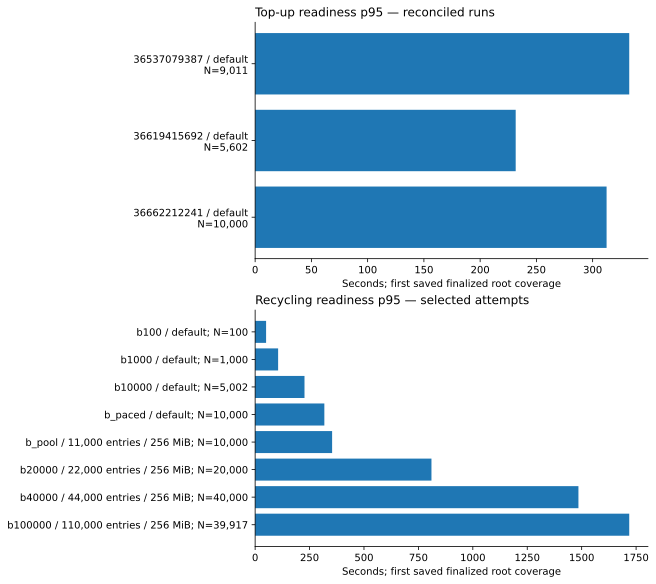
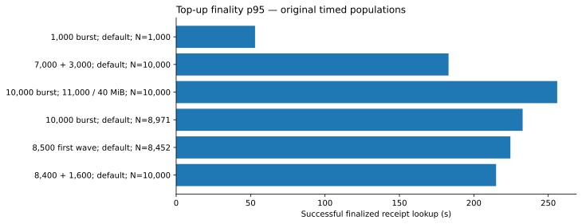
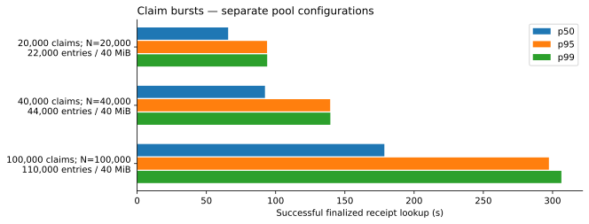
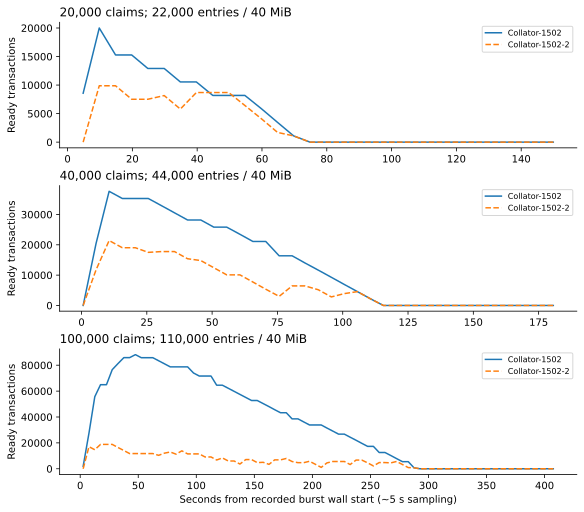
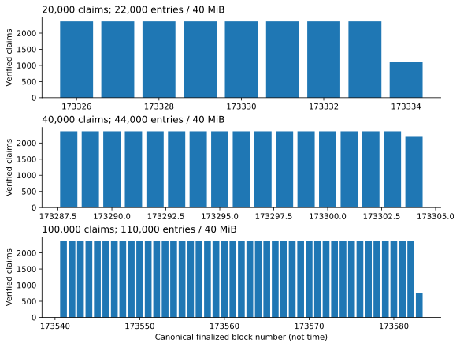
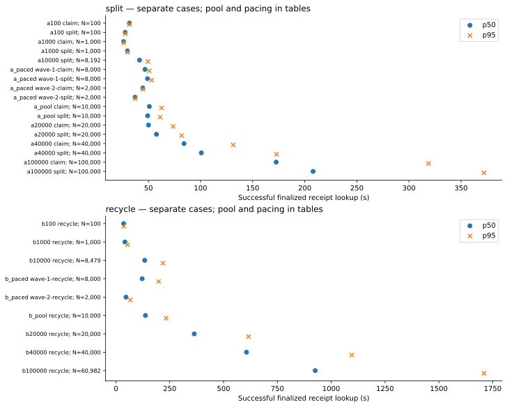
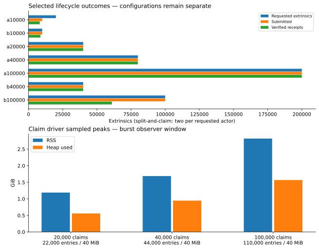

# Coinage stress metrics

[Measured-results summary](measured-results.md) · [Measurement appendix](coinage-stress-metrics-appendix.md) · [Lifecycle audit report](lifecycle-campaign-results.md) · [Download extracted data](evidence/stress-metrics-2026-10-05/metrics.json) · [SHA-256 checksum](evidence/stress-metrics-2026-10-05/SHA256SUMS.txt)

## Summary of measured outcomes

These are saved results from four fixed workloads. Pacing and larger pools each completed 10,000 top-ups and claims. Independent saved-evidence checks cover the 150,000-claim run. The lifecycle campaign completed 100,000 split-and-claim actors with 200,000 successful receipts. Recycling completed 40,000 loads and ready members, while the 100,000 case remains incomplete. These finite bursts do not establish sustainable production throughput or a physical capacity ceiling.

The 16 selected lifecycle configurations produced **12 workload passes, one launch-timing failure and three incomplete workloads**. Two workload passes had separate CI shutdown failures. The appendix tables use the selected attempts from the completion audit; earlier setup failures remain in the [original-attempt record](lifecycle-campaign-results.md#outcomes).

## Scope and measurement definitions

A top-up debits an external asset and creates a voucher. A claim transfers one root-seeded source coin into its replacement; it does not add one net live coin. Split-and-claim performs a split and then a claim: **two extrinsics per actor**. Recycling loads an existing coin and observes root coverage. Fixtures and the separate smoke transactions are excluded from workload counts. These tests omit the production wallet planner, chat delivery, TrUAPI and mobile payment experience. Root-seeded claims and lifecycle fixtures bypass issuance and wrapped-asset hold setup; unchanged fixture backing is not proof of normal held-backing accounting.

All displayed timings are **seconds**. Finality is each submission to successful finalized receipt lookup, including client/RPC overhead. Readiness is submission to the first saved finalized observation of ring-root coverage, including polling delay; it is not wallet privacy readiness. Percentiles use the stated population. Later reconciliation adds receipt evidence, never invented latency samples. An em dash means the value is not established in that record; claim ring readiness is not applicable.

Submission windows and calculated launch rates measure the client, not node acceptance or execution throughput. A burst does not execute simultaneously in one block. Lifecycle stage duration includes audits, applicable inter-wave signing and readiness observation, excluding setup, fixtures, smoke and recovery. Top-up and claim stages include waits, observer shutdown and final state reads, excluding fixture preparation, final aggregate receipt audit and recovery. Recovery checks observe liveness and author participation; their durations are not queue-drain measurements.

### Environment and pool configuration

The lifecycle campaign used engine `7907a3bfa7b2e47535a74b7920086a05ca94773a`, snapshot bundle run 36614342201, six relay validators, two People collators and the snapshot’s other parachains on one runner, with zero synthetic delay. Enlarged lifecycle pools used 256 MiB per People collator; default cases applied no override. No individual transactions were retried. Saved scheduling records cover 27 non-overlapping driver executions; they cannot establish orphaned-process lifetimes after lost runners.

The 20,000–100,000 claim series used the same engine and snapshot, `polkadot-weekly2026w33-rc2` binaries, and People runtime `next-people-paseo`, spec 3003000 / transaction version 5. Exact binary and snapshot hashes, runtime limits and configuration are in the download. Its runner reported AMD EPYC 7B13, 16 cores / 32 logical CPUs and about 62.8 GiB RAM; the network and driver shared it. Pool bytes stayed at 40 MiB, while entry limits, fixture batching, query concurrency and launch targets changed. Earlier run-specific configuration and provenance remain linked from the [evidence record](measured-results.md#evidence-record); settings are not assumed identical across series.

## Top-up

[Scenario](scenarios/top-up-burst.md). All rows below retain the original run references and later reconciliation separately. The earlier successful runs are recorded in the existing report; their p95 values are retained at the published precision.

[View the top-up measurements table in the appendix](coinage-stress-metrics-appendix.md#top-up-measurements).

The 7,000 + 3,000 run launched each wave in 0.282 and 0.103 s; the second began about 196 s after the first and waited for verified receipts. The enlarged-pool burst launched in 0.380 s. All three successful rows above verified debits, ready vouchers and matching backing. See the existing [top-up results](measured-results.md#measured-results) for audit and recovery records.

The default simultaneous run has **8,971 original + 40 reconciled = 9,011 receipts**, plus 989 admission rejections. The paced 8,500 case has **8,452 + 48 = 8,500 receipts**; its second wave was withheld. Its original readiness sample covered **5,602**, while later saved state establishes **5,869**. The extra 267 have no new timing samples. The 8,400 + 1,600 case verified all 10,000 receipts and ready members. All three reconciliation cases passed recovery; debited actors and held/wrapped backing were respectively 9,011 / 18,022, 8,500 / 17,000 and 10,000 / 20,000 test-asset units. Reconciliation was verified 30 September 2026 UTC.

## Claim

[Scenario](scenarios/claim-burst.md). Claim ring readiness is not applicable. A pool-ready notification is an RPC observation of transaction-pool state, not voucher readiness.

[View the claim measurements table in the appendix](coinage-stress-metrics-appendix.md#claim-measurements).

The default 10,000 burst had 989 immediate rejections and 819 dropped watches. Their source coins remained unchanged and recipients absent at the saved state cutoff; dropped watches are not failed-dispatch receipts. The other rows passed receipt and final coin-state checks with unchanged fixture balances, no retries and successful recovery. Claims remove sources and create recipients with the expected instance/value and age 0 → 1. The 150,000 run was independently checked on **2 October 2026 at 03:05 UTC**: 150,000 receipts and saved states, zero mismatches, backing 300,001 → 300,001 raw asset units. The download includes the verifier output and scope; this updates the earlier CI-only verification record.

Fixture balances for the successful 10,000, 20,000, 40,000, 100,000 and 150,000 claim workloads were unchanged at 20,001, 40,001, 80,001, 200,001 and 300,001 raw asset units, respectively.

The paced 10,000 case started its second wave at 52.241 s after the first, following the first 8,000 receipt audit. Its last watch settled at 79.207 s; the enlarged-pool 10,000 burst settled at 55.127 s. For 20,000 / 40,000 / 100,000, preparation took 1,138.347 / 977.091 / 2,440.797 s and launch targets were 1 / 5 / 10 s. The 150,000 launch target was 60 s; its last watch receipt arrived at 509.979 s. Smoke claims are excluded.

The earlier [1,000-claim baseline](measured-results.md#measured-results), [verified memory-fix validation](measured-results.md#verified-1000-claim-validation) and [million-claim generator failure](measured-results.md#claim-generator-memory-retention--2-october-2026) remain separate. The million-claim attempt exhausted the driver’s 24 GiB heap and produced no complete receipt/state audit; it does not establish a chain limit. The [fix](https://github.com/paritytech/polkadot-pop-e2e/commit/932677d50e07052e62d45356a334801dc4630270) bounds retained notifications and cached data without pacing, retries or weaker verification. Its million-notification synthetic regression is not a million-transaction chain run.

### Client notifications and receipt lookup

Re-extracted from saved `claim-burst-transactions.jsonl`, using the submitter’s per-call monotonic start. Each row uses all successful watches in that run. First ready and first inclusion are client notifications; inclusion can precede finality. Finalized notification and completed successful receipt lookup are separate timestamps. Nearest-rank percentiles were recomputed without averaging runs or nodes.

[View the client notifications and receipt lookup table in the appendix](coinage-stress-metrics-appendix.md#client-notifications-and-receipt-lookup).

Client launch rates for the 20,000 / 40,000 / 100,000 bursts were 24,931.9 / 25,284.7 / 25,447.2 submissions/s. These divide submitted count by the unrounded client launch window; they are not sustainable chain TPS.

### Sampled resources and block contents

[View the claim resources table in the appendix](coinage-stress-metrics-appendix.md#claim-resources).

Host and pool values are roughly five-second samples; host CPU is an average across logical CPUs. The appendix’s driver RSS/heap values use burst observer samples, with sample timestamps retained in the download. One logical CPU reached about 98% in the 100,000 run. Low host-average CPU does not rule out serial limits. Proposal duration is authoring time, not PVF execution time.

The 100,000 run used 43 canonical receipt blocks: 42 contained 2,363 claims and the last 754. All 42 full blocks reported `HitBlockWeightLimit`; the last reported `NoMoreTransactions`. Maximum canonical proposal duration was 2.970 s. Enlarging the pool allowed more claims to wait; it did not increase claims per full block. Queue plots use the actual ready gauge, separately for each People collator, during the recorded stage. Watched-plus-unwatched counts are not substituted for this gauge.

## Split-and-claim

[Scenario](scenarios/payment-burst.md). Each actor has one split followed by one claim. Appendix counts are extrinsics, not actor counts.

[View the split-and-claim outcomes table in the appendix](coinage-stress-metrics-appendix.md#split-and-claim-outcomes).

[View the split-and-claim wave timings table in the appendix](coinage-stress-metrics-appendix.md#split-and-claim-wave-timings).

At 20,000 actors, the corrected rerun verified all 40,000 receipts and states, but split launch took **1.099643 s against a 1.000 s target**. It remains a generator launch-timing failure. At 40,000, all 80,000 receipts passed but CI shutdown timed out. At 100,000, all 200,000 receipts and the workload passed. Default 10,000 withheld claims after the incomplete split wave.

## Recycling

[Scenario](scenarios/synchronised-recycling.md). Each actor submits one coin-load extrinsic; root coverage is a separate observation.

[View the recycling outcomes table in the appendix](coinage-stress-metrics-appendix.md#recycling-outcomes).

[View the recycling wave timings table in the appendix](coinage-stress-metrics-appendix.md#recycling-wave-timings).

[View the recycling readiness table in the appendix](coinage-stress-metrics-appendix.md#recycling-readiness).

Default 10,000: **8,479 + 245 reconciled = 8,724 receipts**; 1,276 without receipts. Readiness observed 5,002 of 10,000 by 247.079 s. At 40,000, receipts, state and readiness all passed, but CI hit its two-minute shutdown guard with a retained TCP socket; its owner is not established. Recovery passed in 64.917 s after the guard. At 100,000, all calls were submitted: **60,982 + 8 = 60,990 receipts**, with 39,010 without verified receipts; 39,917 ready and 60,083 unobserved at 1,797.949 s. State has 61,851 members, including 861 state-only outcomes. Blocks 173363, 173365 and 173366 are absent from saved raw evidence. Stage duration is unavailable. Missing receipts and unobserved readiness do not prove non-execution or failure.

### Lifecycle state, backing and sampled resources

The appendix records state and backing observations per selected case. Balances are raw fixture asset units. These lifecycle operations do not perform external-asset top-up debits. Resource windows cover the entire driver step, potentially including fixtures and smoke. Network service cgroup memory includes multiple processes, not one collator. Pool maintenance counters in the data cover their stated epoch window and are not runtime execution timings.

[View the lifecycle state and resources table in the appendix](coinage-stress-metrics-appendix.md#lifecycle-state-and-resources).

## Evidence-backed interpretation

Pool configuration changes backlog capacity, while block weight limits still govern what fits into a block. Pacing and a larger queue both completed particular workloads; comparisons also involve different actors, pool bytes, launch targets and harness versions. The highest passing run is not a measured physical limit. These observations do not establish production capacity, runtime-weight accuracy, block execution wall time or PVF deadline compliance.

Successful receipts require raw extrinsic hash, canonical block/index, `System.ExtrinsicSuccess` and expected operation evidence. State checks are separate. Saved finalized views from local RPC nodes establish evidence consistency, not independent cryptographic consensus or storage proofs. This report re-extracts measurements; it does not rerun workloads or claim a new full receipt audit. Original verification dates are retained in the appendix.

## References and extracted data

[Machine-readable metrics](evidence/stress-metrics-2026-10-05/metrics.json) and [checksum](evidence/stress-metrics-2026-10-05/SHA256SUMS.txt) contain selected measurements, source filenames/hashes, run attempts, runtime/binary provenance and sampled time series. Numeric duration fields use seconds. Millisecond source fields were converted and renamed with a `Seconds` suffix; original source hashes still identify the unmodified preserved files. These small hosted files are not full raw receipt archives. GitHub artifacts expire after 30 days; locally preserved raw archives survive expiry but are not public downloads.

Lifecycle cases were audited **3 October 2026 UTC**. Exact artifact IDs, archive digests and expiry dates are in the [manifest](evidence/lifecycle-2026-10-03/manifest.json); original-attempt history and per-job links are in the [pinned audited report](https://github.com/paritytech/technical-design/blob/e26a47902fa1cbc1a9dd5dca80d1dc5a2657a508/designs/individuality/non-fun-tests/test-design/lifecycle-campaign-results.md).

[View the lifecycle evidence references table in the appendix](coinage-stress-metrics-appendix.md#lifecycle-evidence-references).

[View the claim evidence references table in the appendix](coinage-stress-metrics-appendix.md#claim-evidence-references).

Earlier top-up and 10,000-claim commits, original verification dates and artifact IDs remain in the [existing evidence record](measured-results.md#evidence-record). The [claim methodology](https://github.com/paritytech/polkadot-pop-e2e/blob/dfdc44a75bc91ea1610742b42b4e5278f4ad42fd/ci/previewnet/burst-results.md) is separate from the [top-up evidence guide](https://github.com/paritytech/polkadot-pop-e2e/blob/feat/th-coinage-top-up-burst/ci/previewnet/burst-results.md).
